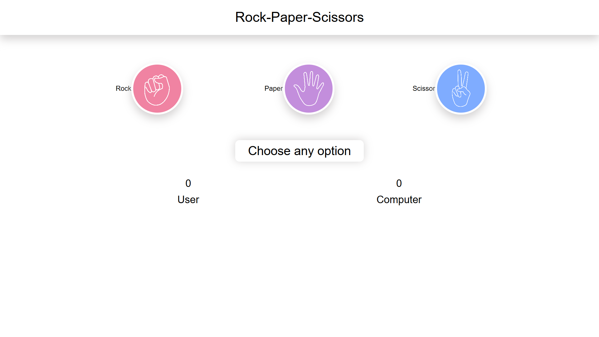
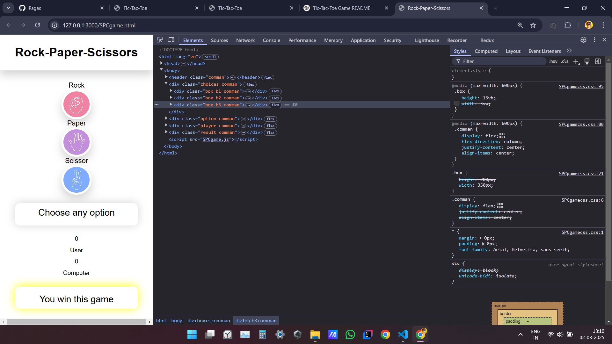

# ✊✋✌ Rock-Paper-Scissors Game
A simple and interactive Rock-Paper-Scissors game built using HTML, CSS, and JavaScript. The game allows the user to play against the computer with real-time scoring and a responsive UI.

# 📌 Features
✅ User vs Computer Gameplay
✅ Randomized Computer Choices
✅ Win/Loss Detection
✅ Score Tracking (User & Computer)
✅ Responsive UI (Works on all devices)

# 🎮 How to Play
Select Rock 🪨, Paper 📄, or Scissors ✂ by clicking on the icons.
The computer will randomly choose an option.
The game will determine the winner based on the classic rules:
Rock beats Scissors
Scissors beat Paper
Paper beats Rock
The winner's score increases.
The game displays the result: Win, Lose, or Draw.

# 🛠️ Technologies Used
HTML – Structure of the game
CSS – Styling and layout (Responsive UI)
JavaScript – Game logic, random selection, and result calculation

# 📸 Preview

# 🔧 How to Run Locally
Clone the repository:
bash
Copy
Edit
git clone https://github.com/your-username/rock-paper-scissors.git
Open index.html in a browser.
Start playing! 🎉

# 🤝 Contributing
Feel free to fork the repo and submit pull requests to improve the game!